# Group 4 Final Project

# Overview 

## Description of the dataset

The dataset we chose for our final project contains emission totals per country from The Food and Agriculture Organization. The dataset covers dates January 1, 2000 through December 31, 2020.  The following statistics are tracked in this dataset: area (country), item (source of emission), element (type of emission), unit (emissions = kilotons), and year (total emissions for each year). This dataset was derived from The Food and Agriculture Organization’s Emissions Total Data and The Food and Agriculture Organization’s Definitions and Standards. 

## Selected Topic and Reasoning

For this project, we opted to look at enviornmental data and see if the amount of emissions made by each country had any predictable trends and could be fit into a machine learning model. A dataset containing twenty years of emissions data was selected, [Total Emissions per Country (2000-2020)](https://www.kaggle.com/datasets/justin2028/total-emissions-per-country-2000-2020 "Kaggle Dataset"), in order to lead to a better predictive performance and to better fit our machine learning model. 

Furthermore, we want to see if we are able to make predictions using this dataset and the machine learning model, and see if environmental protection agreements have had any impact on the environment and amount of emissions produced each year. 

## Questions we plan to answer with the project
•	Can we predict deaths in a given year, based on emissions?  

# Methodoloy and Technologies Used

## Data Exploration

### Cleaning the Data

An AWS database and bucket were created to host our files. Afterwards, we pulled our CSVs into a jupyter notebook and cleaned them with Pyspark and Pandas. Then we submitted them to our PostgreSQL server for database management in the future. 

As a part of cleaning the data, we removed null values and renamed columns. In addition, we removed columns that were not associated with our analysis in the Causes of Death data. Afterwards, we removed every row that did not having a matching "Area" counterpart in the opposite dataframe. 

#### Total Emissions DataFrame
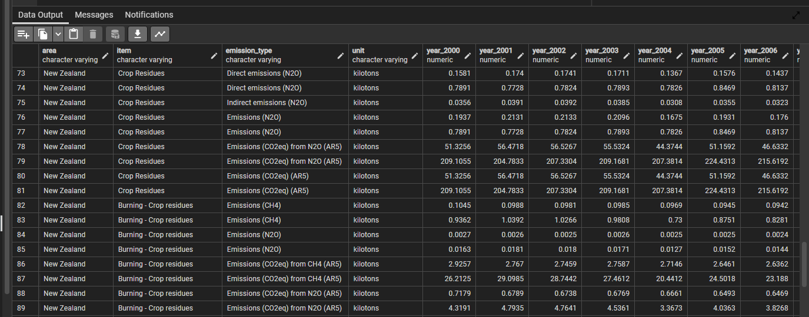

#### Causes of Death DataFrame
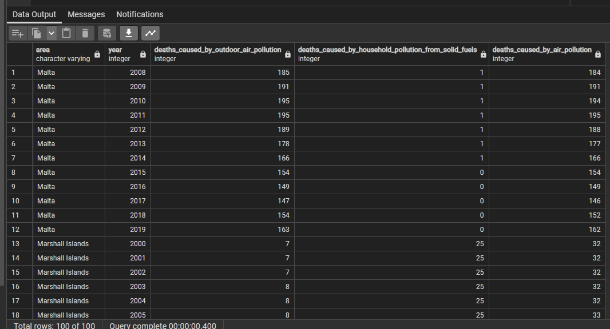

#### Population DataFrame

#### Combined DataFrame

Because the dataset we selected was in a wide format, the data had to be pivoted before we could upload it to PgAdmin to create our tables. However, once the data was pivoted, a list of every unique area in the dataframes was made, as well as a list of areas that were shared. Those were then pivoted and merged together, and finally the 'Reset Index' command was used on the fully merged and cleaned dataset before it was exported for our machine learning model and final visualizations.

#### Merging the Datasets
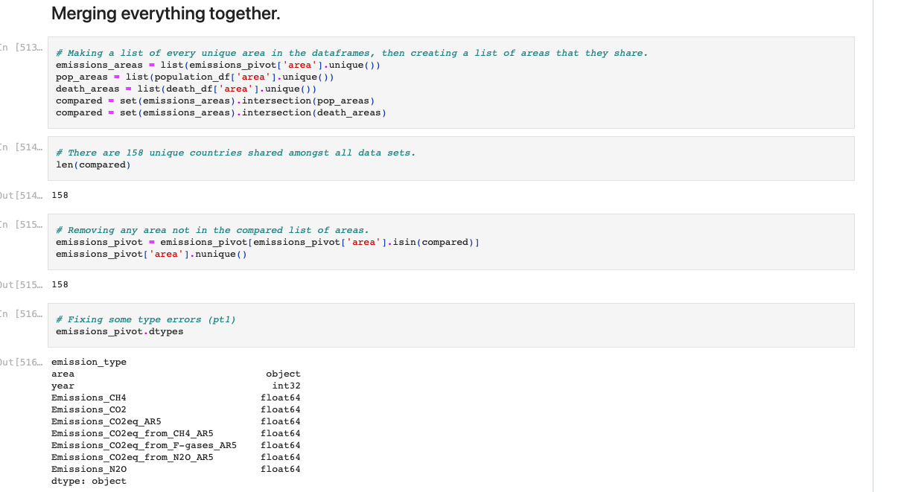

#### Finished and Cleaned Dataset
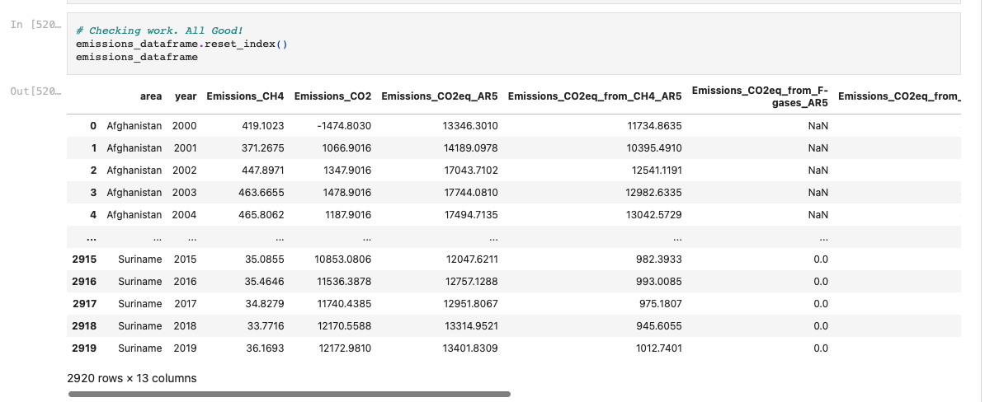

#### Building and Joining the Tables
Finally, the pivoted and cleaned dataset was imported into PgAdmin, showing the tables and columns of the dataset. Using an Entity Relationship Diagram Website, the ERD shows the columns of the dataset and how joins were made. 

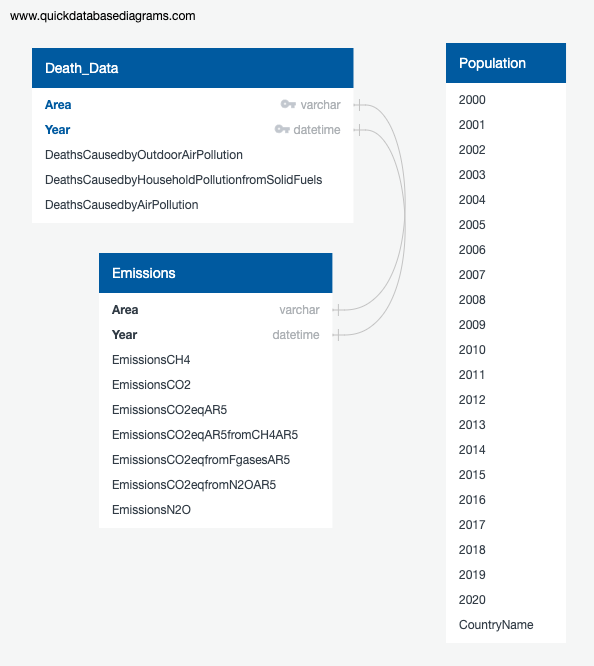

## Machine Learning

### Model Choice

Based on the datasets, a supervised model was selected for a linear regression model. 

### Splitting the Data

The x and y variables were split into training and testing sets. Total emissions and population values were the x variable for the linear regression model, and the y variable was death rate. 

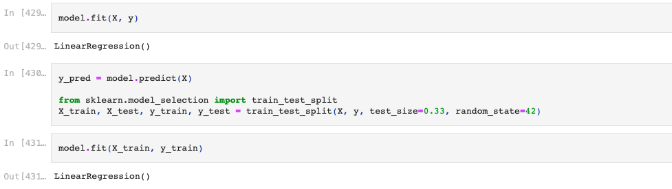

A linear regression model was created to show the deaths based on emissions. 

## Model Visualization

We created a 3d scatter using our variables from our linear regression model. This model confirms a visual lack of correlation between variables. 

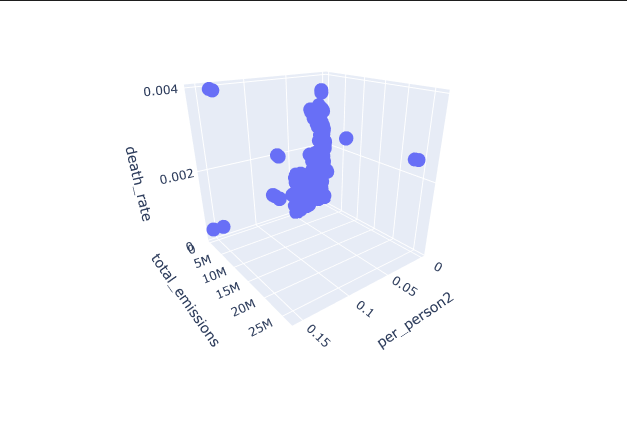

2D scatterplots were also created, using our variables from our linear regression models.

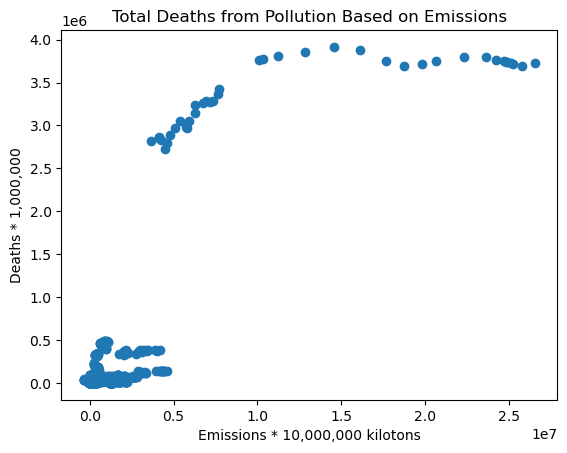

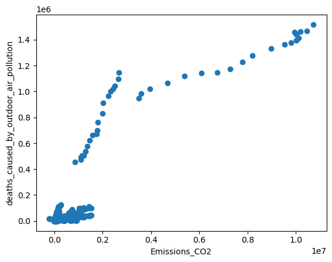 

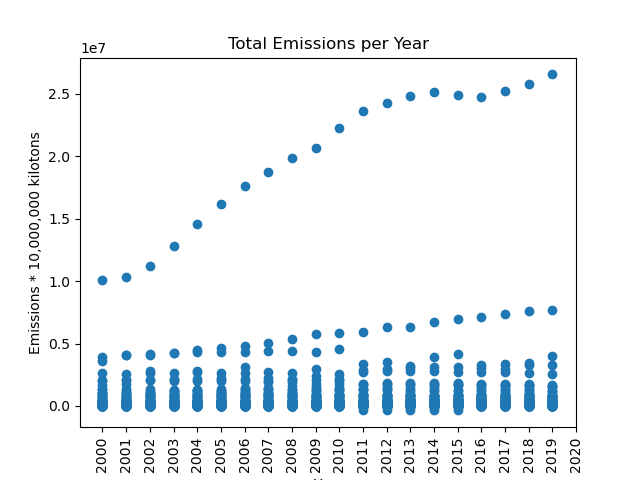

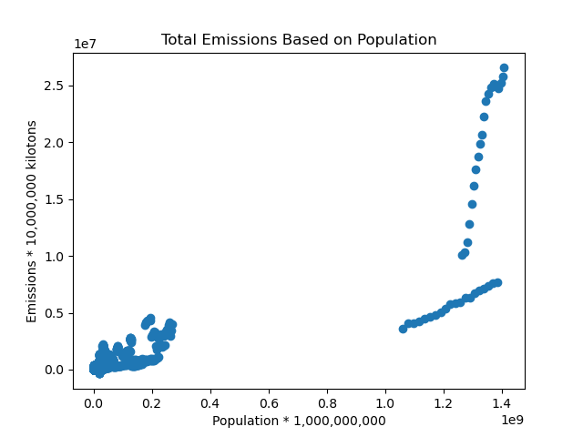

### Accuracy Score
Mean Squared Error: 7.46e-7

R^2: 0.0283

With a low R^2 and a comparably high mean squared error in relation to our dependent variable, our model is not predictive using current data. 

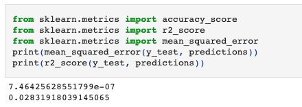
## Dashboards

An interactive dashboard was created in Tableau to allow us to vizualize the data and potential trends. 

#### Emissions Dataframe

#### Emissions by Deaths

#### Countries View

#### Map View

## Summary 

Based on our analysis of the data and the linear regression model used, we were not able to see a strong correlation between the variables. 

## Recommendations for Future Analysis

Based on our analysis of the datasets and our machine learning model, we determined that adding in another descriptor variable, like GDP, could be helpful or narrowing down the countries to a specific number. Another helpful factor could be to find data linking a specific emission type to an illness or death. 

## Viewing the Project
    
### Link to Tableau Story

[Link for Tableau Dashboard](https://public.tableau.com/views/Group_4_FinalProject/ExploreDataFrame?:language=en-US&:display_count=n&:origin=viz_share_link)

### Google Slides

[Google Slides](https://docs.google.com/presentation/d/17nsmgnkjf4xi-R-cXexJHX-mQI7eQgDptAdhs7Cl7a0/edit?usp=sharing "Presentation")

### Link to Datasets
[Total Emissions per Country (2000-2020)](https://www.kaggle.com/datasets/justin2028/total-emissions-per-country-2000-2020 "Kaggle Dataset")

